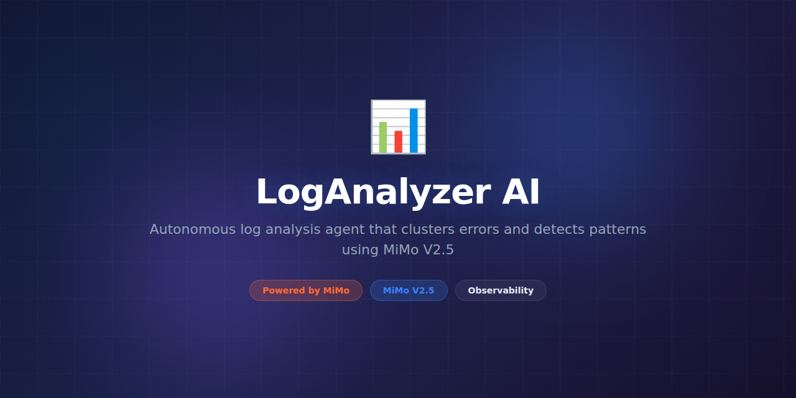

# LogAnalyzer-AI



> **Powered by MiMo** — built on top of Xiaomi's [MiMo](https://platform.xiaomimimo.com) reasoning models for intelligent log pattern detection and root-cause analysis.

[](https://opensource.org/licenses/MIT)
[](https://platform.xiaomimimo.com)

---

## Why MiMo

Production systems generate millions of log lines per hour, and buried in that noise are the signals that separate a minor hiccup from a full outage. MiMo V2.5 brings multi-step reasoning to log analysis — it doesn't just regex-match error strings, it traces causal chains across distributed services to pinpoint where failures originate and how they propagate.

MiMo's reasoning strength is particularly valuable for correlating logs across heterogeneous systems. When a payment service times out because a downstream database connection pool is exhausted because a background job leaked connections because an unhandled exception skipped cleanup — MiMo can follow that entire chain. Traditional log aggregators would surface four separate alerts; MiMo synthesizes them into one actionable root-cause report.

The model also excels at detecting anomalous patterns that don't match known error signatures. MiMo V2.5 builds a semantic understanding of "normal" log behavior for each service and flags deviations even when the log message has never been seen before. This shifts incident detection from reactive pattern matching to proactive anomaly identification, dramatically reducing the time between issue onset and detection.

---

## Token Consumption

| Agent | Model | Tokens/run | Frequency | Daily/user |
|---|---|---|---|---|
| Pattern Detector | MiMo V2.5 | 3,500 | Per batch (5min) | ~100,800 |
| Root Cause Analyzer | MiMo V2.5 | 5,000 | Per incident | ~10,000 |
| Anomaly Scorer | MiMo V2.5 | 2,000 | Per batch (5min) | ~57,600 |

---

## What it does

LogAnalyzer-AI ingests logs from multiple sources (syslog, JSON, structured, unstructured), clusters related entries, detects anomalous patterns, and generates root-cause analysis reports. It connects to Elasticsearch, Loki, CloudWatch, and plain files, providing a unified intelligent layer over your existing log infrastructure.

---

## Why this exists

On-call engineers spend hours scrolling through logs during incidents, manually correlating timestamps and guessing at root causes. Log aggregation tools help with search but don't reason about causality. LogAnalyzer-AI bridges the gap between raw log data and actionable intelligence, reducing mean-time-to-resolution (MTTR) from hours to minutes and freeing engineers to focus on fixes rather than forensics.

---

## Features

- **Multi-source ingestion** — Elasticsearch, Grafana Loki, AWS CloudWatch, files, syslog
- **Semantic log clustering** — groups related log entries even with different message formats
- **Causal chain analysis** — traces failures across service boundaries
- **Anomaly detection** — identifies unusual patterns without predefined rules
- **Incident reports** — generates markdown summaries with timeline and root cause
- **Alert integration** — Slack, PagerDuty, Opsgenie webhooks
- **Real-time streaming** — processes logs as they arrive via Kafka or HTTP
- **Historical analysis** — retroactively analyze past time windows
- **Noise filtering** — automatically identifies and suppresses known benign patterns
- **Severity classification** — ranks detected issues by business impact potential

---

## Tech Stack

- **Python 3.11+** — core runtime
- **MiMo V2.5** — pattern detection and root-cause reasoning via Xiaomi API
- **Elasticsearch** — log storage and search backend
- **Apache Kafka** — real-time log streaming
- **FastAPI** — REST API for analysis queries
- **Redis** — caching and deduplication
- **Grafana** — dashboard visualization
- **Docker** — deployment and local development

---

## Quickstart

```bash
# Clone and install
git clone https://github.com/yuroo-shield/LogAnalyzer-AI.git
cd LogAnalyzer-AI
pip install -e ".[dev]"

# Set your MiMo API key
export MIMO_API_KEY="your-key-here"

# Start dependencies
docker-compose up -d elasticsearch redis kafka

# Analyze a log file
loganalyzer analyze \
  --source /var/log/app.log \
  --format auto \
  --window 1h

# Connect to Elasticsearch and stream
loganalyzer stream \
  --es-url http://localhost:9200 \
  --index "app-logs-*" \
  --alert-webhook https://hooks.slack.com/...

# Generate incident report for a time window
loganalyzer report \
  --es-url http://localhost:9200 \
  --start "2026-05-24T01:00:00Z" \
  --end "2026-05-24T03:00:00Z"
```

---

## Project Structure

```
LogAnalyzer-AI/
├── assets/
│   └── banner.png
├── loganalyzer/
│   ├── __init__.py
│   ├── ingestion.py       # Multi-source log ingestion
│   ├── clustering.py      # Semantic log clustering
│   ├── detector.py        # MiMo-powered anomaly detection
│   ├── rootcause.py       # Causal chain analysis
│   ├── reporter.py        # Incident report generation
│   ├── alerter.py         # Alert webhook dispatching
│   ├── noise_filter.py    # Benign pattern suppression
│   └── config.py          # Configuration management
├── connectors/
│   ├── elasticsearch.py
│   ├── loki.py
│   ├── cloudwatch.py
│   └── kafka.py
├── tests/
│   ├── test_clustering.py
│   ├── test_detector.py
│   ├── test_rootcause.py
│   └── conftest.py
├── docker-compose.yml
├── pyproject.toml
└── README.md
```

---

## Contributing

We welcome contributions! Please see [CONTRIBUTING.md](CONTRIBUTING.md) for guidelines. Run the test suite before submitting PRs:

```bash
# Run tests
pytest tests/ -v

# Run with coverage
pytest tests/ --cov=loganalyzer --cov-report=html
```

---

## License

This project is licensed under the MIT License — see the [LICENSE](LICENSE) file for details.
